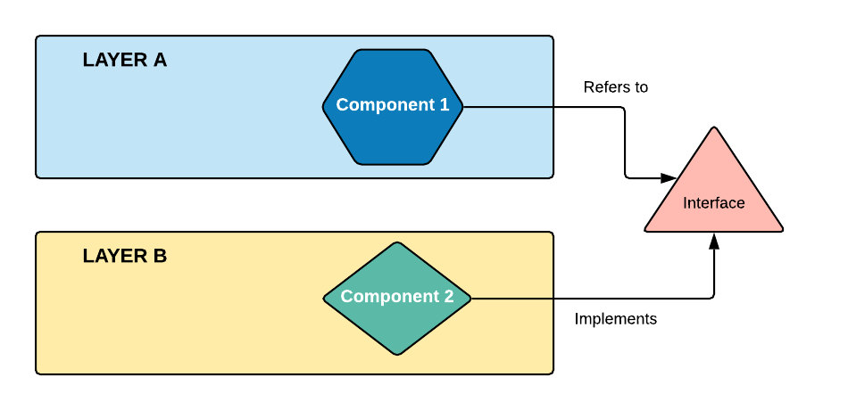

# Documentación

## 📝 Tabla de contenidos

- [Inicio](../../README.md)
- [Arquitectura](#arquitectura)
- [Capas](#capas)

---

## 🏗️ Arquitectura <a name = "arquitectura"></a>

Para desarrollar este proyecto se utilizó el patrón de desarrollo conocido como **inversión de dependencias**, el cuál se basa en el principio de que los módulos de alto nivel no deben depender directamente de los módulos de bajo nivel, en su lugar, tanto los módulos de alto nivel como los de bajo nivel, deberían depender de abstracciones. Ver [Figura 1](#figura1).

 

_Figura 1_

Este enfoque de diseño fomenta la modularidad y la separación de responsabilidades en el software. Al aplicar la inversión de dependencias, se logra un sistema más flexible y desacoplado, lo que facilita la reutilización de componentes y mejora la mantenibilidad en general.

Basándonos en la [Figura 1](#figura1), pdemos observar tres capas distintas, las cuales se traducen en nuestro proyecto en tres clases diferentes: **interfaces**, **controladores** y **repositorios**.

1. Las **interfaces** son abastracciones que definen los contratos y las operaciones que deben ser implementadas por otras clases. Estas interfaces actúan como puntos de entrada y salida del sistema, proporcionando métodos que permiten la interacción con el exterior.

2. Los **controladores** son los encargados de recibir las solicitudes vía **HTTP**, gestionar el acceso a los repositorios, así como retornar una respuesta a cada solicitud.

3. Los **repositorios** son los responsables de la gestión del acceso a los datos y de la lógica de negocios.

---

## 📃 Capas <a name = "capas"></a>

Para irnos familiarizando con la estructura, a continuación veremos un ejemplo, usando la base de datos **AdventureWorks2019**, de como obtener datos de la tabla customers.

### Interfaz

[Ver el archivo completo](../../Interfaces/ICustomer.cs)

```
using csharp_api.DatabaseModels;

namespace csharp_api.Interfaces;

public interface ICustomer
{
    // Obtiene todos los clientes de la base de datos
    Task<Customer[]> GetAll();
}

```

En esta clase únicamente se describe el comportamiento que tendrá un módulo en específico, en ella se podría agregar **N** cantidad de funciones.

---

### Controlador

[Ver el archivo completo](../../Controllers/CustomerController.cs)

```
using csharp_api.DatabaseModels;
using csharp_api.Interfaces;
using Microsoft.AspNetCore.Mvc;

namespace csharp_api.Controllers;

[ApiController]
[Route("api/[controller]")]
public class CustomerController : ControllerBase
{
    // Se instancia la interfaz
    private readonly ICustomer _interface;
    public CustomerController(ICustomer @interface)
        => _interface = @interface;

    // Obtiene todos los clientes de la base de datos
    [HttpGet]
    public async Task<IActionResult> GetAll()
        => Ok(await _interface.GetAll());
}

```

Al analizar con atención, podemos notar que el controlador está utilizando la inyección de una interfaz. Como bien sabemos, una interfaz no contiene lógica en sí misma, sino que establece un contrato que debe ser implementado por otras clases.

Otro aspecto relevante es que el controlador solo define un método **HTTP**, en este caso, el método **GET**, y utiliza el método **GetAll** de la interfaz inyectada para obtener los datos. A continuación, retorna una respuesta con el código de estado OK. En este contexto, el controlador no incorpora lógica de negocios específica, sino que actúa como intermediario para procesar las solicitudes.

Si ya te has adentrado en el múndo de la programación **WEB** te estarás preguntando por que solo se regresa el mensaje **OK (200)** y no aplico ninguna lógica para regresar un mensaje **Not Found (404)** en caso de que no se encuentren registros. Esto es debido a que **Not Found (404)** se refiere exclusivamente a que un recurso solicitado no existe, es decir, si hago una llamada a un API a través de una dirección que no existe. Cualquier mensaje que se regrese que sea diferente a un **OK (200)** será considerado por el cliente como un error de comunicación entre el cliente y el servidor, por lo que será necesario optar por otros mecanismos en caso de que se requiera informar al cliente que no se encontraron los registros solicitados, pero eso es tema para después.

---

### Repositorio

[Ver el archivo completo](../../Repositories/CustomerRepository.cs)

```
using csharp_api.DatabaseModels;
using csharp_api.Interfaces;
using Microsoft.EntityFrameworkCore;

namespace csharp_api.Repositories;

public class CustomerRepository : ICustomer
{
    // Objeto que facilita el acceso a la base de datos
    private readonly DatabaseContext _context;
    // Se inyecta el objeto DatabaseContext
    public CustomerRepository(DatabaseContext context)
        => _context = context;

    // Obtiene todos los clientes de la base de datos
    public async Task<Customer[]> GetAll()
    {
        try
        {
            // Se obtienen todos los clientes de la base de datos
            Customer[] customers = await _context.Customers.ToArrayAsync();
            // Se retornan los clientes
            return customers;
        }
        catch (Exception ex)
        {
            // Se lanza una excepción con el mensaje de error
            throw new Exception(ex.Message);
        }
    }
}

```

Finalmente, en el repositorio podemos observar el acceso a los datos y la lógica de negocios, así como la implementación de la interfaz, sin embargo, para que esto tenga efecto y que el controlador pueda acceder a la lógica de negocios dentro del repositorio, es necesario realizar un paso más, y registrar el servicio dentro del archivo [Program.cs](../../Program.cs) de la siguiente manera:

```
using csharp_api.DatabaseModels;
using csharp_api.Interfaces;
using csharp_api.Repositories;
using Microsoft.EntityFrameworkCore;

var builder = WebApplication.CreateBuilder(args);

// Add services to the container.
builder.Services.AddDbContext<DatabaseContext>(
    (options) =>
    {
        options.UseSqlServer(builder.Configuration.GetConnectionString("Connection"));
    }
);

// REGISTRO DEL SERVICIO
builder.Services.AddScoped<ICustomer, CustomerRepository>();
// FIN DEL REGISTRO DEL SERVICIO

builder.Services.AddControllers();

builder.Services.AddEndpointsApiExplorer();
builder.Services.AddSwaggerGen();

var app = builder.Build();

if (app.Environment.IsDevelopment())
{
    app.UseSwagger();
    app.UseSwaggerUI();
}

app.UseHttpsRedirection();

app.UseAuthorization();

app.MapControllers();

app.Run();

```
